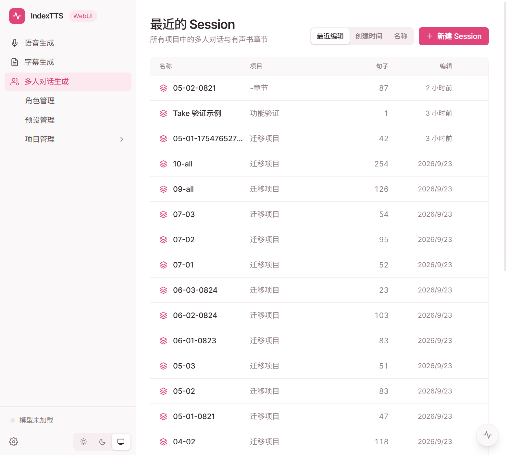

# IndexTTS WebUI

基于 [IndexTTS 1.5](https://github.com/index-tts/index-tts) 的本地 WebUI。主要功能包括
- 单句语音生成
- 字幕生成
- 多角色对话 / 有声书的逐句生成、试听与合并

使用轻量但功能全面的架构。快速启动，任务队列，适合个人电脑使用。



模型许可见 `INDEX_MODEL_LICENSE`，使用须知见 `DISCLAIMER`。

## 环境准备

需要：

- NVIDIA 显卡与支持 CUDA 12.8 的驱动（可以自己改 pyproject.toml 中的依赖版本）
- [uv](https://docs.astral.sh/uv/)（ Python 3.12 与 PyTorch 2.8.0 + cu128）
- [Node.js](https://nodejs.org/) 与 [pnpm](https://pnpm.io/)（构建前端）
- `ffmpeg` 需在 PATH 中（字幕、合并音频使用）

在仓库根目录执行：

```powershell
uv sync
pnpm --dir frontend install --frozen-lockfile
pnpm --dir frontend build
```

下载 IndexTTS 1.5 模型到 `checkpoints/`：

```powershell
uv run huggingface-cli download IndexTeam/IndexTTS-1.5 config.yaml bigvgan_generator.pth bpe.model dvae.pth gpt.pth unigram_12000.vocab --local-dir checkpoints
```

（国内可先设置 `$env:HF_ENDPOINT="https://hf-mirror.com"`）

（可选）字幕生成还需要本地 Whisper 模型，可选 `tiny` / `base` / `small` / `medium`，放在 `checkpoints/whisper/whisper-<size>`：

```powershell
uv run huggingface-cli download openai/whisper-base --local-dir checkpoints/whisper/whisper-base
```

（可选）DeepSpeed 可选（`uv sync --extra deepspeed`），未安装时使用标准 PyTorch 推理。

## 启动

```powershell
uv run main.py          # 或双击 run.bat；可加 --host / --port
```

打开 http://127.0.0.1:7863 。模型在第一次生成时自动加载，也可在「设置」中手动加载 / 卸载以释放显存。

## 准备参考音频

参考音频放在仓库根目录的 `samples/`（也可以是指向其他目录的链接），在文件系统中自行整理；WebUI 会读取其中的音频作为参考音频。支持 wav、mp3、flac、ogg、m4a、aac。

```text
samples/
  角色1/
    0 正常.wav
    情绪/愉悦.wav
  角色2/
  _其他/
    晓晓.wav
```

- 给角色增删参考音频，就是在它的文件夹里增删文件；文件名会显示在选择框里，建议写上情绪或台词。
- 也可以在选择框旁上传音频，上传的文件保存在 `data/` 中；相同内容只保存一份。

## 使用

### 语音生成 / 字幕生成

- **语音生成**：选择参考音频（可输入文字筛选，↑↓ 选择、回车确认），输入文本，Ctrl + Enter 或点击生成。结果出现在「最近生成」和右下角任务面板中，可试听、重命名、下载。
- **字幕生成**：选择上传的音频、samples 中的音频或已生成的音频，选择 Whisper 模型与语言，生成后下载 SRT。

### 角色与预设

- **角色管理**：新建与 `samples/` 下文件夹同名的角色，文件夹中的音频即其参考音频（专用角色）。旁白、路人等没有固定声音的角色勾选「匿名角色」，可使用任意音频。角色改名前，请先在文件系统中把文件夹改成新名字。
- **预设管理**：把一组「说话人 → 角色 + 参考音频」和推理参数保存为预设。新建 Session 时可选择预设；Session 设置中也可「存为预设」（同名覆盖）。

### 项目与 Session（多人对话 / 有声书）

1. 在「项目管理」中新建项目，在项目中新建 Session（一个章节或一段对话），可选预设。
2. 点击「台本」，按每行一句写入文本：

   ```text
   [旁白] 故事从这里开始。
   [卡维] 你威胁我？卑鄙！
   （括号开头的行和空行是注释）
   ```

   右侧会逐行对比现有句子：绿色为新增，黄色为修改，红色为删除，格式错误的行会列出，修正后才能确认。之后可以随时再用「台本」批量增删改，未改动的句子保留已生成的音频。
3. 在「设置」中为每个说话人绑定角色与参考音频，调整推理参数与句间隔。
4. 「全部生成」或逐句生成。每次生成都会保留为一个 Take，可展开试听历史 Take 并选择当前使用的版本；文本或参数改动后，旧 Take 会标记为「已过期」。
5. 「合并」按当前顺序把每句的当前 Take 拼成一个音频，可在页面底部试听、下载、生成字幕。

其他操作：

- 句子悬停可上下移动；右上角「多选」可勾选多句后批量下载（zip）、清理或删除。
- 「清理」删除不再需要的音频：可选「未使用的 Take 与已删除句子的音频」或「仅已删除句子的音频」。当前 Take 不会被删除。
- 生成、合并、字幕都在右下角的任务面板中排队执行，可取消、查看详情、复制错误信息、清除记录。

## 数据与备份

WebUI 的所有数据（角色、预设、项目、Session、生成的音频、任务记录）保存在 `data/`，可用环境变量 `WEBUI3_DATA` 指向其他目录。备份时复制 `data/` 与 `samples/` 即可。

## 文档

- [docs/architecture.md](docs/architecture.md)：前后端结构、模块与数据一致性规则
- [docs/data.md](docs/data.md)：`data/` 目录与记录格式

开发：后端运行时执行 `pnpm --dir frontend dev`（http://127.0.0.1:5173）；测试 `uv run python -m unittest discover -s tests`。
