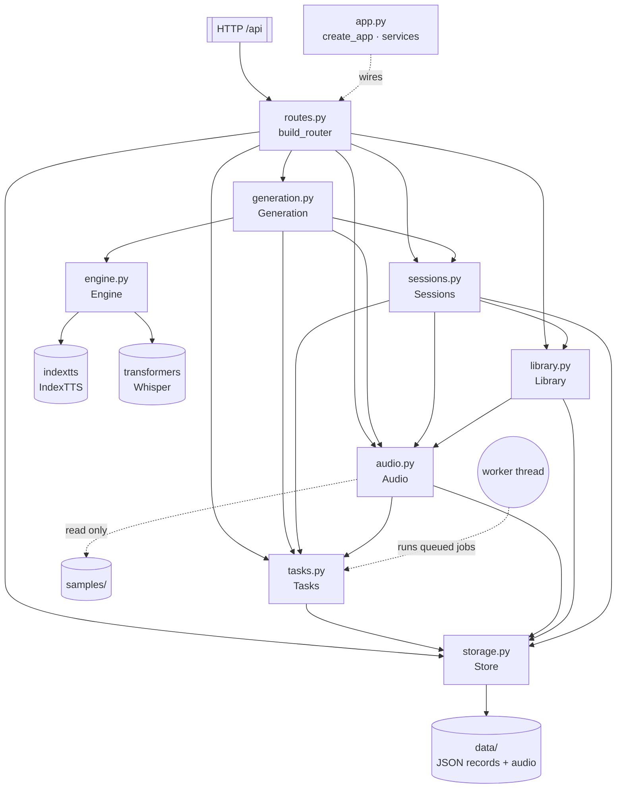
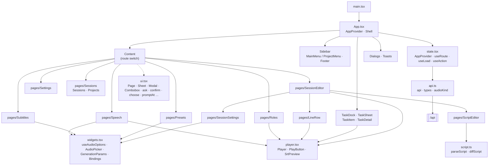
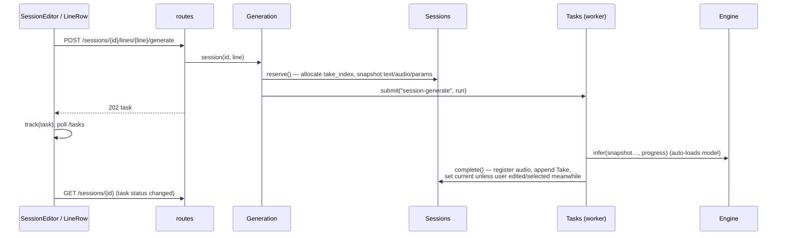

# System Design

The WebUI is a single-process app: a FastAPI backend serves a REST API under `/api` and the built React frontend (`frontend/dist`) at `/`. All GPU work runs on one background worker thread; all state is JSON files and audio under `data/` (layout: [data.md](data.md)). Reference audio is read in place from `samples/`, which only the user edits. The full API reference is generated by FastAPI at `http://127.0.0.1:7863/docs` while the server runs.

## Backend

Layers, top to bottom: HTTP translation → domain services → task queue / inference → storage. `schemas.py` (Pydantic) validates every request body; `config.py` holds paths (`DATA` can be overridden with `WEBUI3_DATA`).

## Frontend

## Workflow

Every request falls into one of two shapes:

- **Synchronous CRUD** (roles, presets, projects, sessions, lines, 台本, take selection, cleanup, renames): the route calls a service, which takes `Store.lock`, reads → modifies → atomically writes the JSON records, and returns the new record. The frontend replaces its local copy with the response.
- **Asynchronous GPU work** (speech, subtitles, session/line generation, merge, model load/unload): the route calls `Generation`, which validates inputs, enqueues a closure via `Tasks.submit`, and returns the task record with HTTP 202. The single worker thread runs the closure; the closure reports through `progress(value, desc)`, which persists progress and raises `Cancelled` if cancellation was requested.

The frontend tracks tasks by polling, not WebSocket: `AppProvider` fetches `/tasks` and `/models` every 0.8 s while anything is active and every 4 s otherwise; `track(task)` adds a just-submitted task and triggers an immediate poll. From the polled list it also derives the task dock's states (running wave, start ring, unseen-finish dot) and the merge done/failed toasts. `SessionEditor` reloads its session whenever the status of one of its tasks changes, and marks lines listed in active tasks' `line_ids` as busy.

Generating a session line, end to end:

Errors map uniformly: `ValueError` → 400, `Busy` (session has an active task) → 409, `KeyError` → 404; the frontend's `useAction` shows the `detail` as a toast.

### Consistency rules

- **Audio is referenced by id, never by path.** Bindings, take snapshots, tasks and merge outputs hold `audio_id`; renaming a display name changes one audio record only. Takes are the exception: they have no record, and their file is derived from session, line and take (`take_file`).
- **A session's files live with the session, not the project.** Audio is under `sessions/<id>/`; `project_id` (nullable: no project) is just a field, so changing project moves nothing.
- **Roles have no stored audio.** A role's audio is whatever `samples/<name>/` holds, listed on each request; anonymous roles (旁白, 路人…) and bindings without a role may use any audio. Renaming a role re-points its bindings and take snapshots to the same relative files in the new folder (`Library.rebind_plan` + `Sessions.rebind`), or is refused if a bound file has no counterpart.
- **台本 keeps line identities.** The frontend diffs the edited text against the session and sends the resulting order: entries with a `line_id` keep that line (index, takes); others are new lines with fresh, never-reused indexes. Lines left out are removed but their take files stay until orphan cleanup.
- **Nothing is stored twice.** samples files are referenced in place (one record per path); an upload identical to an earlier upload or a samples file returns the existing record.
- **Deletion is explicit.** Only cleanup (unused takes / orphaned takes of removed lines), session/project deletion and task-record deletion remove files, all inside `data/`; current takes, anything referenced, and anything an active task uses are protected.

## Backend modules

| Module | Main class / function | Responsibility |
|---|---|---|
| `app.py` | `services`, `create_app` | Build the service graph, register error handlers and router, mount `frontend/dist`; on shutdown close the queue and unload the model. |
| `storage.py` | `Store` | One JSON file per record under `data/<kind>/<id>.json` (`roles`, `presets`, `projects`, `sessions`, `audio`, `tasks`). Atomic temp-file replace, path containment checks, a shared `RLock` held across read-modify-write. `save(…, touch=False)` keeps `updated_at` for consistency fixes that are not user edits. |
| `tasks.py` | `Tasks`, `Busy`, `Cancelled` | Single worker queue that owns all GPU use. Task records persist status/progress; on restart queued/running tasks become `interrupted` and untitled records get a fallback title. Cancellation is cooperative at `progress()` boundaries. `ensure_idle` guards sessions from edits during their tasks. `delete` removes finished records (selected or all); finished records older than 30 days are pruned at startup. |
| `engine.py` | `Engine` | Lazy IndexTTS adapter: `load` / `unload` / `infer` (normal or fast mode), guarded by a lock so the model loads once. `subtitles` unloads TTS first, then runs a local Whisper pipeline via ffmpeg and writes SRT. |
| `audio.py` | `Audio` | Index of every playable/downloadable file as an `audio` record. `upload` (500 MB cap) returns an identical existing record instead of storing a second copy (`same_as`); `sample` / `import_source` / `folder` register samples files in place (`source: "samples"`, id hashed from the relative path); `file` / `path` resolve a record to disk; `referenced()` is the set of ids cleanup must never delete. Names: files from disk use their file name; generated audio has a display name without extension. |
| `library.py` | `Library` | Roles (name, tags, `anonymous`) with their audio read from `samples/<name>/` (`view`); binding validation; `rebind_plan` for renames and mark changes; multi-speaker presets (`bindings` + generation params). |
| `sessions.py` | `Sessions` | Projects → sessions → lines → takes. Line `index` is a stable, never-reused identity; order is the list order. Take lifecycle: `reserve` (snapshot + path) → `complete` (append, auto-select unless `revision`/`selection_revision` changed) → `select` → `cleanup` (non-current takes and/or orphans: `takes/<line_id>/` folders of lines the 台本 removed). `apply_script` replaces the line list; `delete_lines` removes lines with their take files; `archive` lists current takes of chosen lines for download; `rebind` rewrites bindings and take snapshots across all sessions and presets. `take_file` / `take_path` derive a take's audio file. |
| `generation.py` | `Generation`, `title` | Turns requests into queued jobs: model load/unload, single speech, subtitles, session/line generation, and merge (pydub concat of current takes with `interval` gaps). `title` makes the extension-less display name of generated audio. |
| `routes.py` | `build_router` | Thin HTTP layer. Small orchestration only: role updates apply `rebind_plan` then `rebind`; the selected-lines download zips `Sessions.archive` entries into a temp file removed after sending; task results are returned with the current audio record (so renames show); downloads append the real file suffix to display names. |
| `schemas.py` | `Generation`, `Role`, `Preset`, `SessionInput`, `Script`, `Speech`, … | Strict Pydantic inputs (`extra="forbid"`), including inference parameter bounds and defaults. |

## Frontend modules

| Module | Main exports | Responsibility |
|---|---|---|
| `api.ts` | `api`, `upload`, `fileUrl`, types, `audioKind`, `taskTitle` | Typed fetch wrapper for `/api`; turns error `detail` into `Error`. Mirrors backend record shapes (`Session`, `Line`, `Take`, `Task`, `Role`, …). `audioKind` tells files from disk (sample, upload) from generated audio (speech, subtitle, merge); `takeUrl` addresses a take's audio. |
| `state.tsx` | `AppProvider`, `useRoute`/`go`, `useLoad`, `useAction`, `useStored` | Hash routing (`#/projects/<id>/sessions/<id>`), adaptive task/model polling, task dock signals (`started`, `unseen`), theme (light/dark/system), toasts, and small data hooks. |
| `App.tsx` | `App`, `Shell` | Two-column layout: sidebar switching between the main menu and the project menu, route-driven content, model status + theme footer, floating task dock and task sheet (clear finished, multi-select delete). |
| `ui.tsx` | `Page`, `Section`, `Sheet`, `Modal`, `Combobox`, `ask`, `confirm`, `choose`, `promptAt`, `Dialogs`, `NameInput`, `CopyButton` | Presentational primitives and imperative dialogs. Popovers (`confirm`, `choose`, `promptAt`) open at the pointer; Escape closes only the topmost layer. `Combobox` filters by typing, ↑/↓ + Enter to pick. |
| `widgets.tsx` | `useAudioOptions`, `AudioPicker`, `GenerationParams`, `Bindings` | Domain inputs: audio options grouped as 上传 / 生成的音频 (tagged) / samples; pick or upload reference audio; inference params; speaker → role + audio, where a regular role offers its folder and an anonymous role any audio. |
| `player.tsx` | `Player`, `PlayButton`, `SrtPreview` | One shared `<audio>` element exposed through `useSyncExternalStore`, keyed by URL (an audio record's `id` or a take's `src`); starting a clip stops the previous one. Previews share one pattern: preview + rename (popover; changes only the display name) + download. |
| `TaskItem.tsx` | `TaskItem` | Task row: status, progress, cancel, copy error, result preview; hover title for the detail modal; checkbox in multi-select mode. |
| `script.ts` | `parseScript`, `diffScript`, `scriptBody` | 台本 format (`[speaker] text`, blank/bracketed lines are comments) and a git-like diff: LCS anchors, similar lines in between pair up as modified so they keep their takes. |
| `pages/Speech`, `Subtitles` | — | Single-sentence TTS and SRT generation; results arrive as tasks. On narrow screens 参考音频 comes first. |
| `pages/Roles` | `Roles` | Roles grouped as 专用角色 (folder audio, listed read-only) and 匿名角色; name, tags, 匿名 checkbox. |
| `pages/Presets` | `Presets` | Multi-speaker preset CRUD: bindings and inference params. Applied when creating a session. |
| `pages/Sessions` | `Sessions`, `Projects` | Session list (sortable by name / updated / created), project list, project cleanup. |
| `pages/SessionEditor` | `SessionEditor` | Session view with breadcrumb, paginated lines, batch generate, merge, cleanup (two modes via `choose`), 台本 and settings. Multi-select mode (icon at the end of the chip row): check lines, then download their current takes as a zip, clean their unused takes, or delete them. |
| `pages/ScriptEditor` | `ScriptEditor` | 台本 modal: text on the left with invalid lines listed, live diff on the right (added / modified / deleted). Unapplied drafts persist per session in this browser. |
| `pages/LineRow` | `LineRow`, `isStale` | Edit / reorder / delete a line, generate it, browse and select takes; flags takes whose snapshot no longer matches the current text, binding or params. |
| `pages/SessionSettings` | `SessionSettings` | Session name, project, interval, bindings and params; save the bindings as a preset (same name overwrites). |
| `pages/Settings` | `Settings` | Model load/unload and data directory info. |
