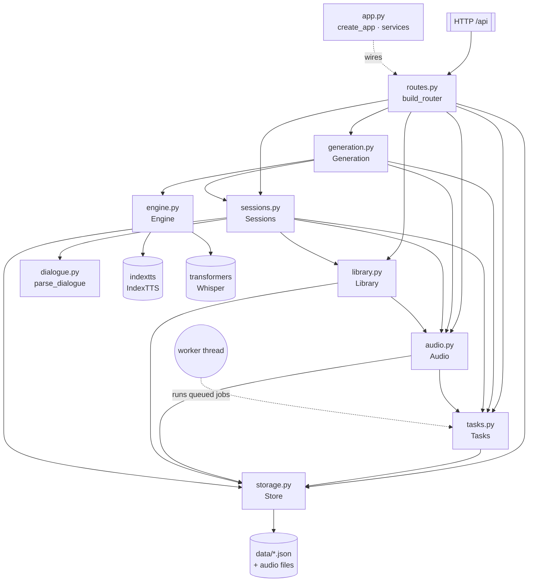
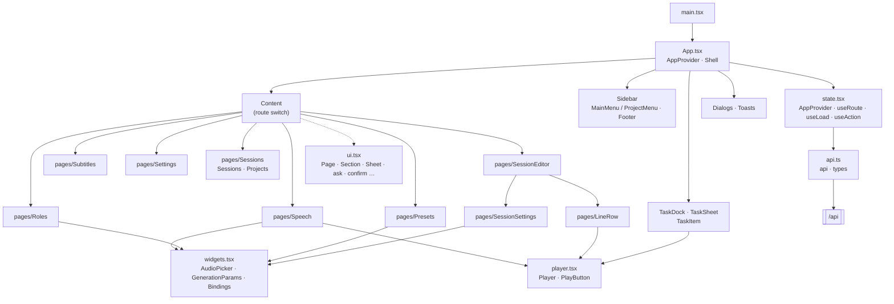
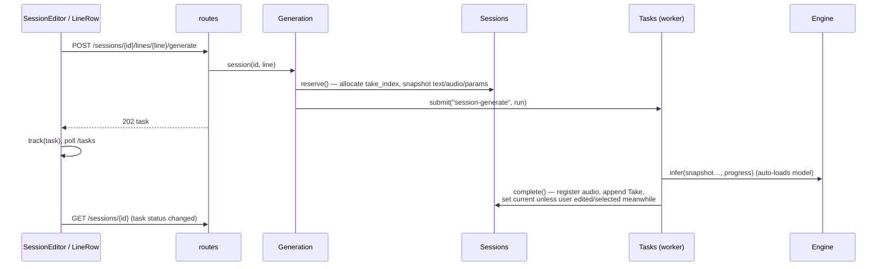

# System Design

The WebUI is a single-process app: a FastAPI backend serves a REST API under `/api` and the built React frontend (`frontend/dist`) at `/`. All GPU work runs on one background worker thread; all state is JSON files under `data/`.

## Backend

Layers, top to bottom: HTTP translation → domain services → task queue / inference → storage. `schemas.py` (Pydantic) validates every request body; `config.py` holds paths.

## Frontend

## Workflow

Every request falls into one of two shapes:

- **Synchronous CRUD** (roles, presets, projects, sessions, lines, take selection, cleanup): the route calls a service, which takes `Store.lock`, reads → modifies → atomically writes the JSON record, and returns the new record. The frontend replaces its local copy with the response.
- **Asynchronous GPU work** (speech, subtitles, session/line generation, merge, model load/unload): the route calls `Generation`, which validates inputs, enqueues a closure via `Tasks.submit`, and returns the task record with HTTP 202. The single worker thread runs the closure; the closure reports through `progress(value, desc)`, which persists progress and raises `Cancelled` if cancellation was requested.

The frontend tracks tasks by polling, not WebSocket: `AppProvider` fetches `/tasks` and `/models` every 0.8 s while anything is active and every 4 s otherwise; `track(task)` adds a just-submitted task and triggers an immediate poll. Pages react to task state: `SessionEditor` reloads its session whenever the status of one of its tasks changes, and marks lines listed in active tasks' `line_ids` as busy.

Generating a session line, end to end:

Errors map uniformly: `ValueError` → 400, `Busy` (session has an active task) → 409, `KeyError` → 404; the frontend's `useAction` shows the `detail` as a toast.

## Backend modules

| Module | Main class / function | Responsibility |
|---|---|---|
| `app.py` | `services`, `create_app` | Build the service graph, register error handlers and router, mount `frontend/dist`; on shutdown close the queue and unload the model. |
| `storage.py` | `Store` | One JSON file per record under `data/<kind>/<id>.json` (`roles`, `presets`, `projects`, `sessions`, `audio`, `tasks`). Atomic temp-file replace, path containment checks, a shared `RLock` held across read-modify-write. |
| `tasks.py` | `Tasks`, `Busy`, `Cancelled` | Single worker queue that owns all GPU use. Task records persist status/progress; on restart queued/running tasks become `interrupted`. Cancellation is cooperative at `progress()` boundaries. `ensure_idle` guards sessions from edits during their tasks. `delete` removes finished records (selected or all); finished records older than 30 days are pruned at startup. |
| `engine.py` | `Engine` | Lazy IndexTTS adapter: `load` / `unload` / `infer` (normal or fast mode), guarded by a lock so the model loads once. `subtitles` unloads TTS first, then runs a local Whisper pipeline via ffmpeg and writes SRT. |
| `audio.py` | `Audio` | Index of every playable/downloadable file as an `audio` record. Upload (500 MB cap), import from `samples/`, path lookup, and `referenced()` — the set of ids cleanup must never delete. |
| `library.py` | `Library` | Roles (name, tags, `audio_ids`) and multi-speaker presets (`bindings` + generation params). Refuses to delete roles or detach audio still bound by a session or preset. |
| `dialogue.py` | `parse_dialogue` | Parse `[speaker] text` lines; skip blanks and `(`/`（` comment lines; report invalid line numbers. |
| `sessions.py` | `Sessions` | Projects → sessions → lines → takes. Line `index` is a stable, never-reused identity; order is the list order. Take lifecycle: `reserve` (snapshot + path) → `complete` (append, auto-select unless `revision`/`selection_revision` changed) → `select` → `cleanup` (delete non-current, unprotected takes). Session JSON is mirrored to `projects/
/sessions/<s>/index.json`. |
| `generation.py` | `Generation` | Turns requests into queued jobs: model load/unload, single speech, subtitles, session/line generation, and merge (pydub concat of current takes with `interval` gaps). |
| `routes.py` | `build_router` | Thin HTTP layer; no business rules. |
| `schemas.py` | `Generation`, `Role`, `Preset`, `SessionInput`, `Speech`, … | Strict Pydantic inputs (`extra="forbid"`), including inference parameter bounds and defaults. |

## Frontend modules

| Module | Main exports | Responsibility |
|---|---|---|
| `api.ts` | `api`, `upload`, `fileUrl`, types | Typed fetch wrapper for `/api`; turns error `detail` into `Error`. Mirrors backend record shapes (`Session`, `Line`, `Take`, `Task`, …). |
| `state.tsx` | `AppProvider`, `useRoute`/`go`, `useLoad`, `useAction`, `useStored` | Hash routing (`#/projects/<id>/sessions/<id>`), adaptive task/model polling, theme (light/dark/system), toasts, and small data hooks. |
| `App.tsx` | `App`, `Shell` | Two-column layout: sidebar switching between the main menu and the project menu, route-driven content, model status + theme footer, floating task dock and task sheet. |
| `ui.tsx` | `Page`, `Section`, `Field`, `Sheet`, `Segmented`, `ask`, `confirm`, `Dialogs`, `NameInput` | Presentational primitives and imperative dialogs. |
| `widgets.tsx` | `AudioPicker`, `GenerationParams`, `Bindings` | Domain inputs shared by pages: choose/upload/import reference audio, edit inference params, map speakers to role + audio. |
| `player.tsx` | `Player`, `PlayButton`, `SrtPreview` | One shared `<audio>` element exposed through `useSyncExternalStore`; starting a clip stops the previous one. Previews share one pattern: preview + rename (popover at the pointer; changes only the download name) + download. |
| `TaskItem.tsx` | `TaskItem` | Task row: status, progress, cancel, and result player or SRT download. |
| `pages/Speech`, `Subtitles` | — | Single-sentence TTS and SRT generation; results arrive as tasks. |
| `pages/Roles` | `Roles` | Role CRUD with tags and reference audio sets. |
| `pages/Sessions` | `Sessions`, `Projects` | Session list (sortable by name / updated / created) and project list. |
| `pages/SessionEditor` | `SessionEditor` | Session view with breadcrumb, paginated lines, batch generate, merge, cleanup, and settings sheet. |
| `pages/LineRow` | `LineRow`, `isStale` | Edit / reorder / delete a line, generate it, browse and select takes; flags takes whose snapshot no longer matches the current text, binding or params. |
| `pages/Presets` | `Presets` | Multi-speaker preset CRUD: bindings and inference params. Applied when creating a session. |
| `pages/SessionSettings` | `SessionSettings` | Session name, project, interval, bindings and params; save the bindings as a preset (same name overwrites). |
| `pages/Settings` | `Settings` | Model load/unload and data directory info. |
